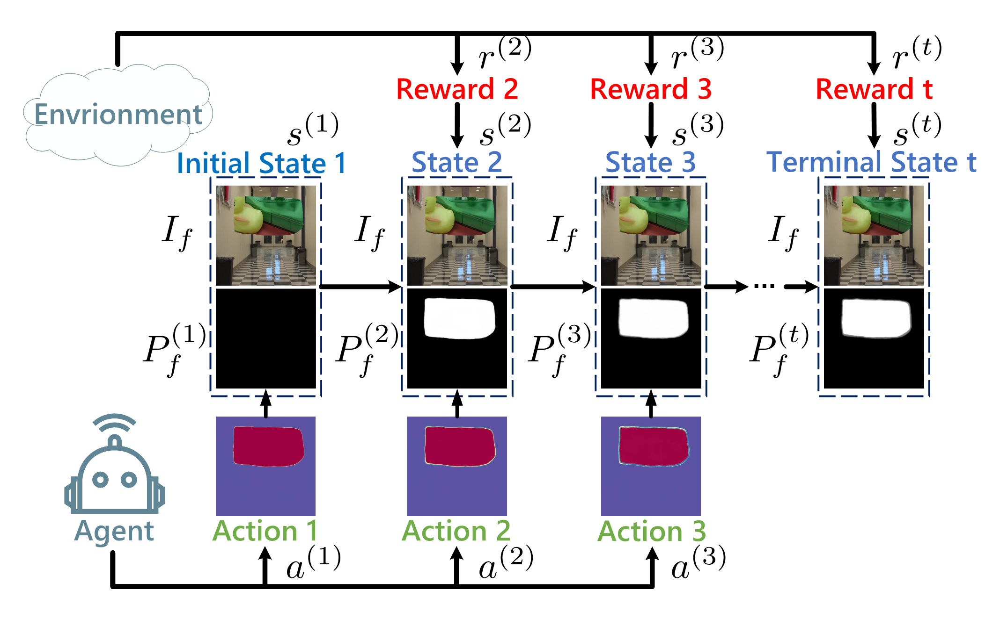
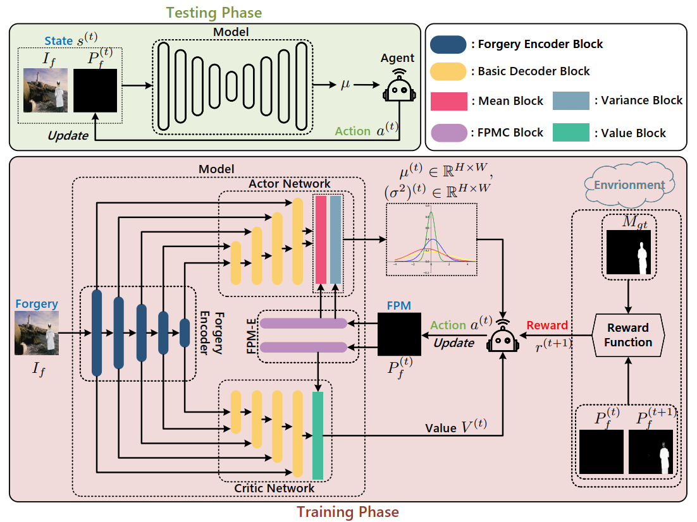
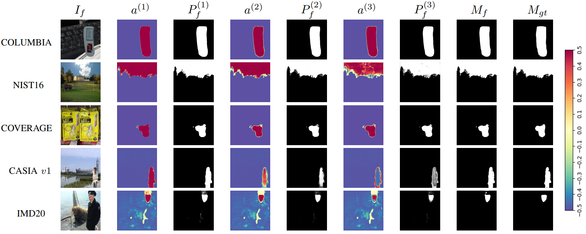

# Employing Reinforcement Learning to Construct a Decision-making Environment for Image Forgery Localization

## Table of Contents

- [Introduction](##Introduction)
- [Dependency](##Dependency)
- [Installation](#installation)
- [Usage](#usage)

## Introduction
The widespread misuse of advanced image editing tools and deep generative techniques has led to a proliferation
of images with altered content in real-life scenarios, often without any discernible traces of tampering. This has 
created a potential threat to security and credibility of images. Image forgery localization is an urgent technique. 
In this paper, we propose a novel reinforcement learning-based framework CoDE (Construct Decision-making Environment) 
that can provide reliable localization result of tampered area in forged images. We model the forgery localization task 
as a Markov Decision Process (MDP), where each pixel is equipped with an agent that performs Gaussian distribution-based 
continuous action to iteratively update the respective forgery probability, so as to achieve pixel-level image forgery 
localization.

    <i>The proposed Markov decision process for image forgery localization.</i>

    <i>The proposed CoDE for image forgery localization task. FPM denotes the forgery probability map.</i>

    <i>Visual results for image sforgery localization on different benchmark datasets using CoDE.</i>

## Dependency
* python 3.7.0
* torch 1.7.1+cu110

## Installation
#### You can run the following commands to create a new environment:
> conda create -n env python=3.7.0\
> pip install -e requirement.txt

#### Or you can directly run this command to setup your environment:
> conda env create -f environment.yaml

## Usage
#### Data Preparation:
> Put the images in "dataset/forgery/" and the ground-truth of masks in "dataset/gt/", then generate the index "data.txt" under "dataset/".\
> We have given the template of "dataset/", please check in the directory for more details.

#### Pre-trained Model:
> The pre-trained model can be downloaded from: [Google Drive](https://drive.google.com/file/d/1aXTKhn-vKu4fG7XdKyWv4AWZVMkcIdd3/view?usp=sharing) or [Baidu Pan (Code:CoDE)](https://pan.baidu.com/s/1ltzQjzu5a7OhkwnNOGaRPg)\
> The downloaded file should be placed in "weights/".

#### Training Command:
> python train.py --DATASET dataset --RATIO 0.7 --TRAIN-BATCH-SIZE 8

Here we only present the basic training setting, you can browse 'train.py' for more details.

#### Testing Command:
> python test.py --WEIGHT-PATH ./weights/pretrained_CoDE.pth --DATASET dataset --RATIO 0 --VISUALIZE 0

When --VISUALIZE is True (1), the results for action map, forgery probability map and predicted mask will be saved in the 'result/'.

